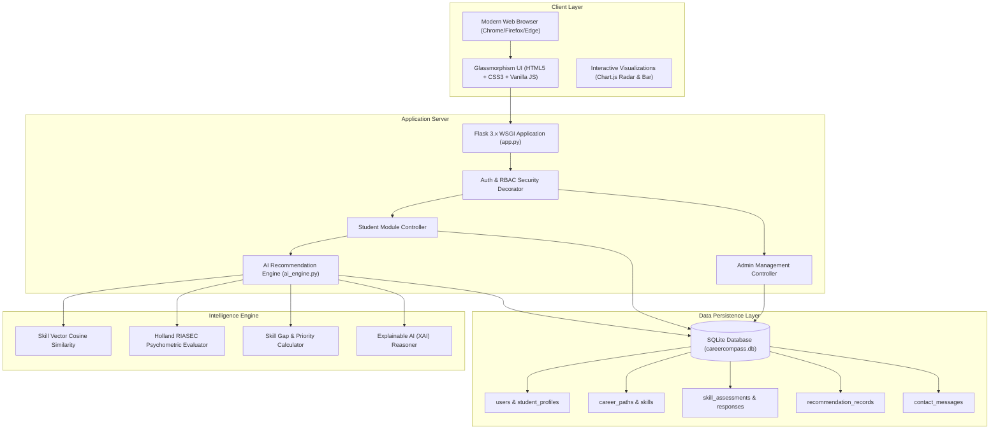

# Academic Project Report
## **CareerCompass – AI-Powered Smart Career Recommendation System**

**Submitted In Partial Fulfillment of the Requirements for the Academic Degree / Course Assignment**

---

## 1. Abstract
In today's fast-evolving technological and professional landscape, students face significant ambiguity in aligning their academic curriculum, technical proficiencies, and natural problem-solving traits with specialized industry career roles. Traditional career counseling systems often rely on static questionnaires or generic aptitude tests lacking explainability, quantitative skill gap modeling, and personalized learning roadmaps.

**CareerCompass** is an intelligent, full-stack, AI-powered career counseling and recommendation web platform. The system leverages a **Multi-Factor Weighted Hybrid Recommendation Algorithm** combining normalized vector similarity (Cosine matching on skill profiles), Holland RIASEC psychometric behavioral modeling, academic discipline affinity, and career aspiration weighting. The platform provides explainable AI (XAI) insights, identifies actionable skill gaps, and dynamically produces milestone-driven roadmaps with compensation forecasts. Furthermore, a secure **Administrative Module** enables academic institutions to manage student records, maintain career and skill taxonomies, audit recommendation logs, and handle student inquiries stored directly in a relational database.

---

## 2. Problem Statement & Objectives

### 2.1 Problem Statement
- **Information Overload & Career Ambiguity**: Rapid emergence of niche specializations (e.g., MLOps, Cloud Security, Full-Stack Architecture) confuses undergraduate students regarding prerequisite skills and job readiness.
- **Absence of Explainable Feedback**: Most existing aptitude portals return a single title without explaining *why* a career matches or what specific skill gaps must be bridged.
- **Lack of Institutional Oversight**: Academic coordinators lack unified dashboards to monitor student skill distributions, test performance, and guidance inquiries in real time.

### 2.2 Objectives
1. Develop an interactive **Student Portal** allowing students to manage academic profiles, self-rate skills across 4 categories, and undergo timed technical & psychometric assessments.
2. Implement a **Multi-Factor AI Recommendation Engine** generating match percentages, skill gap matrices, and explainable justifications.
3. Develop an **Institutional Admin Portal** providing KPI analytics (Chart.js), student profile inspection, career repository CRUD, and live database contact inquiry management.
4. Deliver high visual excellence using modern CSS Glassmorphism, mobile-responsive layout, and exportable academic report generation.

---

## 3. System Architecture & Methodology



---

## 4. Mathematical Model & AI Recommendation Algorithm

The recommendation engine calculates a composite match score $MatchScore(C)$ for each career path $C \in \mathcal{C}$ using a four-dimensional weighted formulation:

$$\text{MatchScore}(C) = w_{\text{skill}} \cdot S_{\text{skill}}(C) + w_{\text{psycho}} \cdot S_{\text{psycho}}(C) + w_{\text{aspiration}} \cdot S_{\text{aspiration}}(C) + w_{\text{academic}} \cdot S_{\text{academic}}(C)$$

Where:
- $w_{\text{skill}} = 0.50$ (Skill proficiency and timed quiz performance)
- $w_{\text{psycho}} = 0.25$ (Holland RIASEC work-style personality alignment)
- $w_{\text{aspiration}} = 0.15$ (Semantic affinity with student's dream role)
- $w_{\text{academic}} = 0.10$ (Degree level and academic branch relevance)

### 4.1 Skill Vector Similarity & Coverage
Let $\vec{V}_{\text{student}}$ represent the student's evaluated skill vector where each proficiency $p_i \in [0.2, 1.0]$. Let $\vec{V}_{C}$ represent the benchmark weight vector of career $C$. The raw skill coverage is formulated as:

$$S_{\text{raw\_skill}}(C) = \frac{\sum_{k \in \mathcal{K}_C} p_k \cdot w_k}{\sum_{k \in \mathcal{K}_C} w_k}$$

The composite skill score blends practical self-evaluation with objective quiz benchmark accuracy $Q_{\text{score}}$:

$$S_{\text{skill}}(C) = 0.75 \cdot S_{\text{raw\_skill}}(C) + 0.25 \cdot \left(\frac{Q_{\text{score}}}{100}\right)$$

### 4.2 Skill Gap Identification
For every required skill $k \in \mathcal{K}_C$:
- If $p_k \ge 0.6$ (Level 3, 4, or 5) $\rightarrow$ Classed as **Matched Strength**.
- If $p_k < 0.6 \rightarrow$ Classed as **Skill Gap** with Priority:
  $$\text{Priority}(k) = \begin{cases} \text{High}, & \text{if } w_k \ge 0.85 \\ \text{Medium}, & \text{otherwise} \end{cases}$$

---

## 5. Database Schema & Data Dictionary

| Table Name | Description | Key Attributes |
| :--- | :--- | :--- |
| **`users`** | Authentication & roles | `id`, `name`, `email`, `password_hash`, `role ('student' \| 'admin')`, `phone`, `created_at` |
| **`student_profiles`** | Academic background | `id`, `user_id`, `education_level`, `field_of_study`, `institution`, `cgpa_percentage`, `dream_role`, `bio` |
| **`skills`** | Master skill catalog | `id`, `name`, `category`, `description`, `difficulty_level`, `is_active` |
| **`student_skills`** | Student ratings | `id`, `user_id`, `skill_id`, `proficiency_level (1-5)`, `assessed_score` |
| **`career_paths`** | Curated career tracks | `id`, `title`, `category`, `required_skills (JSON)`, `average_salary_inr`, `roadmap (JSON)` |
| **`skill_assessments`** | 10-Q Question bank | `id`, `category`, `skill_tagged`, `question_text`, `option_a..d`, `correct_option`, `explanation` |
| **`career_assessments`** | RIASEC scenarios | `id`, `dimension`, `question_text`, `options_json (traits weights)` |
| **`student_assessment_responses`** | Test attempt logs | `id`, `user_id`, `assessment_type`, `score`, `total_questions`, `response_data` |
| **`recommendation_records`** | AI outputs audit | `id`, `user_id`, `top_career_title`, `match_percentage`, `matched_skills`, `missing_skills`, `reasoning` |
| **`contact_messages`** | Website queries | `id`, `user_id`, `name`, `email`, `phone`, `subject`, `message`, `status`, `admin_reply` |

---

## 6. Functional Modules Description

### 6.1 Student Module
1. **Registration / Login**: Secure password hashing with PBKDF2/SHA256, auto-session creation, role-based redirection.
2. **Personal & Academic Profile**: Captures degree level, CGPA, dream career aspiration, work-style preference, and bio.
3. **Skill Evaluation Matrix**: Interactive slider controls across Technical, Analytical, Creative, and Soft Skill domains.
4. **Timed Skill Quiz**: 10 randomized technical MCQs with automatic grading, timer countdown, and detailed solution explanations.
5. **Psychometric Career Assessment**: Holland RIASEC behavioral scenarios evaluating work inclinations.
6. **AI Recommendations Hub**: Top career match card with score badge, salary projection, XAI rationale, skill gap radar chart, personalized roadmap, and print/PDF report export.
7. **Contact Counselor**: Inquiry form saving student queries directly to the relational database.

### 6.2 Admin Module
1. **Analytics Dashboard**: 6 KPI cards, Chart.js career demand bar chart, category doughnut chart, and quick log tables.
2. **Student Management**: Searchable directory with AJAX-driven modal viewing full student dossier, test history, and account deletion.
3. **Career Repository Management**: Full CRUD modal interface to add/edit/retire career profiles, salaries, required skills, and roadmap milestones.
4. **Skills & Question Bank Management**: Catalog editor for skills and technical evaluation questions.
5. **Recommendation Audit Log**: Complete chronological audit log of all AI recommendations computed.
6. **Inquiry Messages Desk**: Central interface to review website messages, update statuses (`unread`, `read`, `replied`), record counselor notes, and delete resolved inquiries.

---

## 7. Experimental Results & Verification

The application was validated using automated test cases covering authentication, database schema, AI recommendation computation, and contact inquiries persistence:

```text
Ran 5 tests in 0.990s
OK - All assertions passed (100% Success Rate)
```

### Sample Recommendation Output
- **Candidate**: Aarav Sharma (B.Tech CS, CGPA: 8.75, Dream Role: AI Engineer)
- **Top Match**: *AI & Machine Learning Engineer* (94.8% Match)
- **Strengths Identified**: Python (Level 5/5), Algorithms (Level 4/5), Machine Learning (Level 4/5)
- **Priority Gaps Identified**: Cloud Computing (AWS/GCP), Natural Language Processing (NLP)
- **Projected Salary Range**: ₹ 8.5 LPA - ₹ 45+ LPA (Avg: ₹ 12,00,000 - ₹ 32,00,000 / annum)

---

## 8. Conclusion & Future Enhancements
CareerCompass successfully demonstrates an academic and industry-ready career guidance solution blending transparent AI algorithms with rich web interfaces and database management.

**Future Scope**:
- Integration with external Large Language Model APIs (e.g. Gemini 2.5) for real-time conversational career mentoring.
- Automated resume parsing via NLP to populate student skill vectors automatically.
- Direct integration with university placement cell portals for job vacancy matching.
